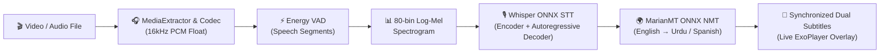

<div align="center">

# ⚡ XORTLOGIX
### 🚀 Enterprise AI Ecosystem • Real-Time Voice RAG • 100% Offline On-Device Media AI

<p align="center">
  <a href="#-ecosystem-at-a-glance"></a>
  <a href="#-offline-ai-video-translator-android"></a>
  <a href="#-offline-ai-video-translator-android"></a>
  <a href="#-sales-voice-co-pilot-rag_sales_assistant_local_ui"></a>
  <a href="#-security--privacy"></a>
</p>

<p align="center">
  <b>A flagship suite of private, local, and high-performance AI engines engineered for enterprise sales intelligence, CRM automations, and zero-latency on-device video translation.</b>
</p>

---

[📱 Offline Video Translator](#-offline-ai-video-translator-android) • [🎙️ Sales Voice Co-Pilot](#-sales-voice-co-pilot) • [⚡ GHL RAG Engine](#-gohighlevel-rag-engine) • [🏗️ Architecture](#️-ecosystem-architecture) • [🚀 Quickstart](#-quickstart)

---

</div>

## 🌌 Ecosystem At A Glance

```
XORTLOGIX/
├── 🎬 offline_ai_video_translator/      # 100% On-Device AI Video/Audio Player & Neural Translator (Android)
├── 🎙️ rag_sales_assistant_local_ui/    # Real-Time Voice Objection Co-Pilot & Sales Battlecards HUD
└── ⚡ GHL_RAG_Project_Local/             # GoHighLevel (GHL) Intelligent CRM Microservice & Vector RAG
```

---

## 🎬 Offline AI Video Translator (Android)
> **Location:** [`./offline_ai_video_translator`](./offline_ai_video_translator)

An **offline-first Android Media Player** that runs automatic speech recognition (OpenAI Whisper) and neural machine translation (MarianMT) **entirely on-device with zero internet or cloud APIs required**.

<div align="center">

| Feature | Description | Tech / Engine |
| :--- | :--- | :--- |
| **🎙️ Speech Recognition** | Voice Activity Detection (VAD) + 80-bin Mel Spectrogram + Whisper ONNX | `OpenAI Whisper-Tiny (INT8)` |
| **🌍 Neural Translation** | Autoregressive Seq2Seq translation from English to Urdu, Spanish, etc. | `MarianMT / OPUS-MT ONNX` |
| **⚡ Real-Time Subtitles** | Binary search subtitle synchronizer with font scaling and dual-language mode | `Android Media3 / ExoPlayer` |
| **📱 Modern UI / UX** | Cyberpunk Dark Mode, Glassmorphism, Material 3, and edge-to-edge Compose | `Jetpack Compose + Kotlin` |
| **📦 Zero Setup / Out of Box** | All AI models are pre-bundled inside the APK; self-extracts on first launch | `Standalone APK (188 MB)` |

</div>

<details>
<summary><b>🔍 Tap to expand Video Translator Architecture Details</b></summary>


</details>

---

## 🎙️ Sales Voice Co-Pilot (`rag_sales_assistant_local_ui`)
> **Location:** [`./rag_sales_assistant_local_ui`](./rag_sales_assistant_local_ui)

A real-time AI sales co-pilot designed to listen to client objections during live calls (**Zoom / Google Meet / MS Teams**) and provide instant, high-converting battlecards and closing strategies.

* **⚡ Sub-Second Retrieval**: `<50ms` vector retrieval across 70 structured enterprise sales battlecards (`zoom.pdf`).
* **🎯 Psychology & Intent Decider**: Uncovers client hidden fears, cost concerns, and provides actionable Do's and Don'ts.
* **🛰️ Live Tab Audio Streaming**: WebRTC-based meeting audio capture with local OpenAI Whisper transcription.
* **🪟 Floating Zoom HUD**: Screen-share safe, draggable, transparent overlay for sales reps.
* **🌓 Dual Theme Cockpit**: Cyber-Dark Glassmorphism and Crisp Light Mode with zero layout shift.

---

## ⚡ GoHighLevel RAG Engine (`GHL_RAG_Project_Local`)
> **Location:** [`./GHL_RAG_Project_Local`](./GHL_RAG_Project_Local)

Enterprise RAG pipeline and automation microservice integrated with GoHighLevel CRM workflows.
* **🧠 ChromaDB Vector Store**: Semantic indexing of customer interactions, workflows, and domain knowledge.
* **🔌 Microservice Architecture**: FastAPI endpoints for seamless webhook integration and automated response generation.
* **📊 SQLite Database Management**: Scalable local tracking of conversations, lead history, and vector embeddings.

---

## 🏗️ Ecosystem Architecture

```mermaid
flowchart TD
    subgraph Mobile ["📱 Mobile Offline AI (Android)"]
        MediaFile["🎬 Local Video / Audio"]
        Decoders["🎧 MediaCodec Audio Pipeline"]
        WhisperEngine["🎙️ Whisper ONNX Mobile"]
        MarianEngine["🌍 MarianMT ONNX Mobile"]
        DualSubs["💬 Synchronized Subtitles (ExoPlayer)"]
    end

    subgraph Desktop ["🖥️ Enterprise Sales Intelligence (FastAPI + RAG)"]
        LiveMeeting["📞 Zoom / Meet / Teams Call"]
        WebRTCStream["⚡ Live Audio Streamer"]
        SpeechSTT["🎙️ Local Whisper Speech Engine"]
        MultiAgentRAG["🧠 Multi-Agent RAG Orchestrator"]
        Battlecards["📚 70 Sales Battlecards + ChromaDB"]
        LocalLLM["🦙 Ollama Local LLMs (Llama 3.2)"]
        GlassmorphismUI["🖥️ Sales Rep Cockpit & Floating HUD"]
    end

    MediaFile --> Decoders --> WhisperEngine --> MarianEngine --> DualSubs
    LiveMeeting --> WebRTCStream --> SpeechSTT --> MultiAgentRAG
    MultiAgentRAG --> Battlecards & LocalLLM --> GlassmorphismUI
```



---

## 🚀 Quickstart Guide

### 📱 1. Run Android Video Translator
```bash
# Navigate to the Android project folder
cd offline_ai_video_translator

# Build debug APK with pre-installed models
./gradlew assembleDebug

# Output APK:
# app/build/outputs/apk/debug/app-debug.apk
```

### 🎙️ 2. Run Real-Time Sales Voice Co-Pilot
```bash
# Navigate to sales assistant
cd rag_sales_assistant_local_ui

# Install dependencies
pip install -r requirements.txt

# Start with one-click launcher
python run_assistant.py
```
> Server boots at `http://127.0.0.1:8000` with the live Glassmorphism HUD.

---

## 🔒 Security & Privacy Guarantees

* 🛡️ **100% On-Device & Air-Gapped**: All Whisper speech recognition, neural translation, ChromaDB vector queries, and LLM inferences execute locally.
* 🚫 **Zero Third-Party APIs**: No OpenAI, Google Cloud, Azure, or AWS API dependencies.
* ✈️ **Airplane Mode Ready**: The Android Video Translator operates seamlessly with Wi-Fi and Cellular Data turned off.

---

<div align="center">

### 🌟 Powered by **XORTLOGIX Engineering**
*Building High-Performance, Privacy-First, On-Device Artificial Intelligence.*

<sub>© 2026 XortLogix. All rights reserved.</sub>

</div>
