<div align="center">

# ⚡ XORTLOGIX
### Enterprise AI Solutions, Real-Time Voice RAG & Automation Ecosystem

[](https://python.org)
[](https://kotlinlang.org/)
[](https://fastapi.tiangolo.com/)
[](https://developer.android.com/jetpack/compose)
[](https://onnxruntime.ai/)
[](https://www.trychroma.com/)
[](https://ollama.ai/)
[](LICENSE)

<p align="center">
  <b>A unified suite of local, private, and high-performance AI tools engineered for enterprise sales intelligence, automated CRM pipelines, intelligent knowledge retrieval, and offline on-device media translation.</b>
</p>

[Ecosystem Projects](#-ecosystem-projects) • [Key Capabilities](#-key-capabilities) • [Architecture](#-architecture) • [Quickstart](#-quickstart) • [Security & Privacy](#-security--privacy)

---

</div>

## 🌌 Ecosystem Projects

```
XORTLOGIX/
├── 🎙️ rag_sales_assistant_local_ui/    # Real-Time AI Sales Voice Co-Pilot & Intent Decider
├── 🎬 offline_ai_video_translator/      # 100% Offline AI Video & Audio Translator Android App
└── ⚡ GHL_RAG_Project_Local/             # GoHighLevel (GHL) Intelligent RAG & CRM Assistant
```

### 1. 🎙️ [Sales Voice Co-Pilot (`rag_sales_assistant_local_ui`)](./rag_sales_assistant_local_ui)
A real-time AI sales co-pilot designed to listen to client objections during live calls (**Zoom / Google Meet / MS Teams**) and provide instant, high-converting battlecards and closing strategies.
- **⚡ Sub-Second Retrieval**: `<50ms` vector retrieval across 70 structured enterprise sales battlecards (`zoom.pdf`).
- **🎯 Psychology & Intent Decider**: Uncovers client hidden fears, cost concerns, and provides actionable Do's and Don'ts.
- **🛰️ Live Tab Audio Streaming**: WebRTC-based meeting audio capture with local OpenAI Whisper transcription.
- **🪟 Floating Zoom HUD**: Screen-share safe, draggable, transparent overlay.
- **🌓 Dual Theme Cockpit**: Cyber-Dark Glassmorphism and Crisp Light Mode with zero layout shift.

### 2. 🎬 [Offline AI Video Translator Android App (`offline_ai_video_translator`)](./offline_ai_video_translator)
A complete, 100% offline, on-device AI-powered media player for Android with real-time subtitle translation and zero cloud dependencies.
- **📱 Modern Tech Stack**: Built with Kotlin, Android Studio, Jetpack Compose, Material 3, and Android Media3 / ExoPlayer.
- **🎙️ On-Device Speech-to-Text**: Energy-based Voice Activity Detection (VAD) + 80-bin Mel Spectrograms + quantized Whisper ONNX model.
- **🌍 Offline Neural Machine Translation**: Autoregressive Seq2Seq translation using MarianMT / OPUS-MT ONNX models (English to Urdu, Spanish, Arabic, French, German, etc.).
- **⚡ Subtitle Synchronization**: Real-time binary search matching with adjustable delays, font scaling, and high-contrast overlay.
- **💾 Smart Persistence & Export**: Room SQLite database prevents reprocessing; export to standard `.srt` or `.vtt`.

### 3. ⚡ [GoHighLevel RAG Engine (`GHL_RAG_Project_Local`)](./GHL_RAG_Project_Local)
Enterprise RAG pipeline and automation microservice integrated with GoHighLevel CRM workflows.
- **🧠 ChromaDB Vector Store**: Semantic indexing of customer interactions, workflows, and domain knowledge.
- **🔌 Microservice Architecture**: FastAPI endpoints for seamless webhook integration and automated response generation.
- **📊 SQLite Database Management**: Scalable local tracking of conversations, lead history, and vector embeddings.

---

## 🏗️ Architecture Overview

```mermaid
flowchart TD
    subgraph Mobile ["📱 Offline AI Video Translator (Android)"]
        MediaSAF["🎬 Local Media (MP4/MKV/MP3/WAV)"]
        AudioDecode["🎧 MediaExtractor + MediaCodec (16kHz)"]
        VAD["⚡ Voice Activity Detection"]
        WhisperONNX["🎙️ Whisper ONNX STT"]
        MarianONNX["🌍 MarianMT ONNX NMT"]
        Subtitles["💬 Synchronized Dual Subtitles"]
        ExoPlayerView["▶️ ExoPlayer Media3 View"]
    end

    subgraph Desktop ["🖥️ Enterprise Sales Co-Pilot & RAG"]
        Call["📞 Live Meeting (Zoom / Meet / Teams)"]
        BrowserUI["🖥️ Real-Time Glassmorphism UI"]
        FastAPIServer["🚀 FastAPI Gateway (:8000)"]
        WhisperSTT["🎙️ Local Whisper STT"]
        RAGEngine["🧠 Multi-Agent RAG Orchestrator"]
        SalesCards["📚 70 Enterprise Battlecards"]
        LocalLLM["🦙 Ollama Local LLMs"]
    end

    MediaSAF --> AudioDecode --> VAD --> WhisperONNX --> MarianONNX --> Subtitles --> ExoPlayerView
    Call --> WhisperSTT --> RAGEngine --> SalesCards & LocalLLM --> BrowserUI
```



---

## 🚀 Quickstart

### Prerequisites
- **Python 3.10+** (For Sales Assistant & GHL RAG)
- **Android Studio / JDK 17** (For Android Video Translator App)
- **Git**

### Installation & Execution

#### Option A: Run the Sales Voice Co-Pilot
```bash
# Navigate to the sales assistant directory
cd rag_sales_assistant_local_ui

# Install dependencies
pip install -r requirements.txt

# Launch with One-Click launcher
python run_assistant.py
```

#### Option B: Build the Offline Video Translator Android App
```bash
# Navigate to the video translator directory
cd offline_ai_video_translator

# Build debug APK
./gradlew assembleDebug
# Generated APK will be in: app/build/outputs/apk/debug/app-debug.apk
```

#### Option C: Run the GHL RAG Microservice
```bash
# Navigate to the GHL project directory
cd GHL_RAG_Project_Local

# Install dependencies
pip install -r requirements.txt

# Start the application
python app.py
```

---

## 🔒 Security & Privacy

- 🛡️ **100% Local & On-Device Execution**: All transcription (Whisper), neural translation (MarianMT), retrieval (ChromaDB), and synthesis (Ollama) run entirely offline.
- 🚫 **Zero Third-Party Data Leakage**: Client audio, videos, and proprietary data never leave your local infrastructure.
- ✈️ **Airplane Mode Ready**: The Android Video Translator operates fully without Wi-Fi, Mobile Data, or external APIs.

---

<div align="center">
  <sub>Developed & Maintained with pride by <b>XortLogix Engineering</b></sub><br>
  <sub>© 2026 XortLogix. All rights reserved.</sub>
</div>
