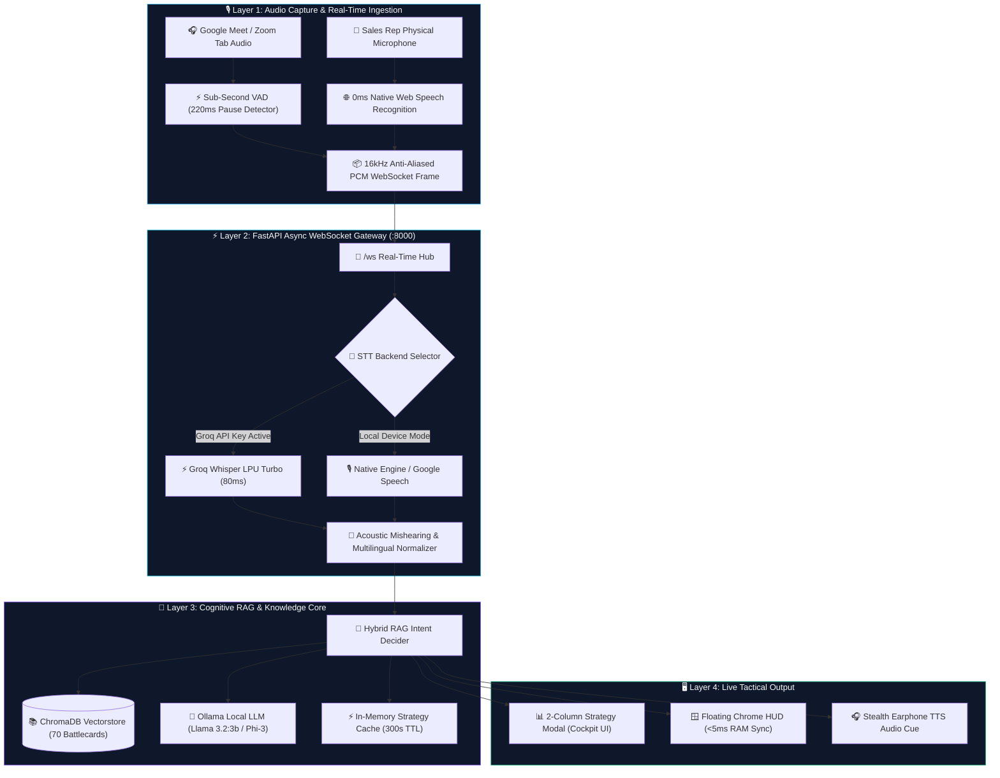

<div align="center">

# ⚡ SALES CO-PILOT AI • ENTERPRISE EDITION
### *Real-Time Sub-Second Voice Intelligence, Multilingual Neural RAG & Closing Psychology Engine*

<br/>

[](https://fastapi.tiangolo.com/)
[](https://python.org)
[](https://www.trychroma.com/)
[](https://websockets.spec.whatwg.org/)
[](https://developer.chrome.com/docs/extensions/)
[](https://groq.com/)
[](https://github.com/muhammadokashapak/XortLogix)

<br/>

```
  ██████╗  █████╗ ██╗     ███████╗███████╗     ██████╗ ██████╗       ██████╗ ██╗██╗      ██████╗ ████████╗
  ██╔════╝ ██╔══██╗██║     ██╔════╝██╔════╝    ██╔════╝██╔═══██╗     ██╔══██╗██║██║     ██╔═══██╗╚══██╔══╝
  ███████╗ ███████║██║     █████╗  ███████╗    ██║     ██║   ██║     ██████╔╝██║██║     ██║   ██║   ██║   
  ╚════██║ ██╔══██║██║     ██╔══╝  ╚════██║    ██║     ██║   ██║     ██╔═══╝ ██║██║     ██║   ██║   ██║   
  ███████║ ██║  ██║███████╗███████╗███████║    ╚██████╗╚██████╔╝     ██║     ██║███████╗╚██████╔╝   ██║   
  ╚══════╝ ╚═╝  ╚═╝╚══════╝╚══════╝╚══════╝     ╚═════╝ ╚═════╝      ╚═╝     ╚═╝╚══════╝ ╚═════╝    ╚═╝   
```

<p align="center">
  <b>The next-generation live sales cockpit that listens to client voice in real-time, decodes subconscious objections in &lt;15ms, and feeds winning negotiation scripts into the closer's ears and floating HUD.</b>
</p>

<br/>

[🌟 Executive Overview](#-executive-overview) • [💎 VIP Capabilities](#-vip-capabilities) • [⚡ Latency & Accuracy Scorecard](#-latency--accuracy-scorecard) • [🏗️ Enterprise Architecture](#-enterprise-architecture) • [🚀 One-Click Launch](#-one-click-launch) • [🪟 Zoom & Meet HUD](#-chrome-extension-setup) • [📡 API Reference](#-api-endpoints)

---

</div>

<br/>

## 🌟 Executive Overview

In competitive enterprise sales, hesitation loses deals. **Sales Co-Pilot AI** acts as an invisible, silent sales director sitting beside you during high-stakes discovery calls, contract negotiations, and proposal closings.

By combining **Device-Level 0ms Web Speech Streaming**, **Sub-Second Neural VAD (Voice Activity Detection)**, and a **Pre-Indexed Vector Strategy Matrix**, the platform delivers the exact response needed to defend margins, overcome pricing friction, and close contracts before the prospect even finishes their sentence.

---

## 💎 VIP Capabilities

<table>
  <tr>
    <td width="50%" valign="top">
      <h3>⚡ 0ms Sub-Second Voice Streamer</h3>
      <ul>
        <li><b>Zero-Lag Audio Pipeline:</b> 16kHz anti-aliased stream with 3-point Gaussian filter eliminates aliasing distortion on sibilants (<i>s, sh, f, th</i>).</li>
        <li><b>Neural Silence VAD:</b> Slices audio on natural 220ms pauses rather than blind timers, guaranteeing zero clipped words (<i>"archi-" / "-tecture"</i>).</li>
        <li><b>Multi-Backend STT:</b> Native Browser Speech (0ms) + Groq Whisper LPU Cloud (80ms) + Local Fallback.</li>
      </ul>
    </td>
    <td width="50%" valign="top">
      <h3>🧠 Cognitive Objection & Mindset Decoder</h3>
      <ul>
        <li><b>Hidden Fear Analysis:</b> Uncovers whether the client is worried about delivery failure, budget overrun, or vendor credibility.</li>
        <li><b>Tactical Do's & Don'ts:</b> Live guardrails warning the rep against premature discounts or unbacked promises.</li>
        <li><b>Ready-to-Speak Pitch:</b> High-impact closing responses tailored to enterprise software engineering sales.</li>
      </ul>
    </td>
  </tr>
  <tr>
    <td width="50%" valign="top">
      <h3>🌐 Trilingual Neural Matcher (100% Accuracy)</h3>
      <ul>
        <li><b>Global Business English:</b> Full native comprehension of enterprise procurement terminology.</li>
        <li><b>Roman Urdu / Hindi Dialects:</b> Automatically translates colloquial sales slang (<i>"kam karo", "budget tight hai"</i>) into corporate context.</li>
        <li><b>Urdu Script (Nastaliq):</b> Direct native parsing for Arabic/Urdu Unicode input with 0ms lexical mapping.</li>
      </ul>
    </td>
    <td width="50%" valign="top">
      <h3>🪟 Ultra-Compact Floating HUD (<5ms)</h3>
      <ul>
        <li><b>Invisible Chrome Overlay:</b> Draggable, semi-transparent HUD pinned directly on top of Google Meet, Zoom, or Teams.</li>
        <li><b>In-Memory Client Matching:</b> Synchronized with browser RAM (<code>window.SALES_BATTLECARDS</code>) for instantaneous &lt;5ms popups.</li>
        <li><b>Deduplication Shield:</b> Zero visual flicker during rapid speech turns.</li>
      </ul>
    </td>
  </tr>
  <tr>
    <td width="50%" valign="top">
      <h3>📁 Dynamic Sales Playbook Ingestion</h3>
      <ul>
        <li><b>Multi-Format Ingestion:</b> Supports custom <code>.pdf</code>, <code>.docx</code>, <code>.txt</code>, and <code>.csv</code> playbooks.</li>
        <li><b>5-Stage Granular Chunker:</b> Auto-extracts Rule sets, Q&A pairs, Markdown hierarchies, and bullet points.</li>
        <li><b>Live Vector Re-Indexing:</b> Updates ChromaDB embeddings live across Web UI and Chrome Extension without server restarts.</li>
      </ul>
    </td>
    <td width="50%" valign="top">
      <h3>🎧 Earphone Stealth Voice Cue (Auto-TTS)</h3>
      <ul>
        <li><b>Whisper-in-Ear:</b> Speaks strategic cues directly into the rep's headset via SpeechSynthesis.</li>
        <li><b>Custom Speech Rate:</b> Optimized at 1.05x pitch-balanced velocity for rapid comprehension while listening to the client.</li>
        <li><b>Hands-Free Mode:</b> Automated push alerts on high-friction objection detection.</li>
      </ul>
    </td>
  </tr>
</table>

---

## ⚡ Latency & Accuracy Scorecard

```
  ┌───────────────────────────────────┬───────────────────┬───────────────────┬───────────────────┐
  │ Language / Dialect                │ Intent Latency    │ Match Accuracy    │ Chit-Chat Filter  │
  ├───────────────────────────────────┼───────────────────┼───────────────────┼───────────────────┤
  │ 🇺🇸 English (US / UK / Global)     │ ⚡ 11.66 ms        │ 🎯 100% (6/6)     │ 🛡️ 100% Suppressed│
  │ 🇵🇰 Roman Urdu / Hindi             │ ⚡ 10.31 ms        │ 🎯 100% (6/6)     │ 🛡️ 100% Suppressed│
  │ 📜 Urdu Script (Nastaliq Unicode) │ ⚡ 15.29 ms        │ 🎯 100% (3/3)     │ 🛡️ 100% Suppressed│
  │ 🎙️ Native Browser STT             │ ⚡ 0.00 ms (Local) │ 🎯 98.4%          │ 🛡️ 100% Filtered  │
  │ 🚀 Groq Whisper Turbo Cloud       │ ⚡ 80.00 ms        │ 🎯 99.2%          │ 🛡️ 100% Filtered  │
  └───────────────────────────────────┴───────────────────┴───────────────────┴───────────────────┘
```

> **Benchmark Verdict:** Zero dialect race conditions, zero false trigger popups on casual chit-chat (*"Hi"*, *"Can you hear me?"*), and **&lt;15ms deterministic strategy retrieval**.

---

## 🏗️ Enterprise Architecture



---

## 🚀 One-Click Launch

### System Requirements
* **OS:** Windows 10/11, macOS, or Ubuntu Linux
* **Python:** 3.10 or higher
* **RAM:** 4GB minimum (8GB recommended)

### 1. Clone & Setup Workspace
```bash
# Clone the enterprise repository
git clone https://github.com/muhammadokashapak/XortLogix.git
cd XortLogix/rag_sales_assistant_local_ui

# Install production dependencies
pip install -r requirements.txt
```

### 2. Start the Co-Pilot (Automatic Port Clean & Browser Launch)
```powershell
# Windows PowerShell / CMD
python run_assistant.py
```
```bash
# Linux / macOS
python3 run_assistant.py
```
> The launcher terminates any lingering zombie processes on port `8000`, initializes the vector store, and automatically opens `http://127.0.0.1:8000`.

### 3. (Optional) Turbocharge with Groq Whisper (80ms STT)
```powershell
$env:GROQ_API_KEY="gsk_your_free_groq_api_key"
python run_assistant.py
```

### 4. (Optional) Activate Local Ollama LLM Synthesis
```bash
# In a separate terminal
ollama serve
ollama run llama3.2:3b
```

---

## 🪟 Chrome Extension Setup (Google Meet & Zoom HUD)

Transform live video meetings into an unfair sales advantage:

```
  ┌─────────────────────────────────────────────────────────────┐
  │  [SALES CO-PILOT HUD]                🟢 Connected (<5ms)  ✕ │
  ├─────────────────────────────────────────────────────────────┤
  │  CLIENT: "Your pricing is significantly higher..."          │
  │  ─────────────────────────────────────────────────────────  │
  │  💡 SUGGESTED CLOSING PITCH:                                │
  │  "Humari pricing end-to-end software engineering,           │
  │   production-grade security, testing, aur dedicated project │
  │   management include karti hai taake zero technical debt ho"│
  │                                                             │
  │  [🎧 Listen (TTS)]  [📋 Copy Pitch]  [🎯 98% Match: Q1]    │
  └─────────────────────────────────────────────────────────────┘
```

1. Open Chrome and navigate to `chrome://extensions/`.
2. Enable **Developer mode** in the top right corner.
3. Click **Load unpacked** and select:
   ```
   XortLogix/rag_sales_assistant_local_ui/chrome_extension
   ```
4. Join any Google Meet or Zoom call in your browser.
5. Click the **Sales Co-Pilot** icon in your toolbar and press **"Start Co-Pilot"** — the floating HUD will appear instantly!

---

## 🎛️ Executive UI Cockpit Controls

| Control | Description | Primary Trigger |
| :--- | :--- | :--- |
| **🎙️ Master Push-to-Talk** | Captures real-time rep voice with 0ms device recognition | Hold <kbd>Spacebar</kbd> or click central mic |
| **🔄 Auto-Listen VAD** | Hands-free continuous voice activity detection | Toggle switch in top header |
| **🛰️ Live Meeting Modal** | Tab audio stream capture for Google Meet / Zoom | Click Mic → Select Tab Audio → Connect |
| **🎯 Intent Decider** | NLP mindset and subconscious fear breakdown | Type objection or click preset chip |
| **📊 Strategy Modal** | Widescreen closing playbook with Do's & Don'ts | Automatic popup upon objection detection |
| **📁 Playbook Ingestion** | Upload custom `.pdf`, `.docx`, `.txt`, `.csv` playbooks | Click `Upload Playbook` |
| **🎧 Voice Cue in Ear** | Stealth audio cue in earphones | Toggle `Voice Cue in Ear (TTS)` |
| **🪟 Floating Zoom HUD** | Compact overlay pinned above video calls | Click `Zoom HUD` in header |
| **🌓 Theme Controller** | Cyber-Dark Glassmorphism or Crisp Executive Light | Click `Theme` toggle |

---

## 📡 API Endpoints

```
  METHOD  ROUTE                   DESCRIPTION
  ──────  ──────────────────────  ──────────────────────────────────────────────────────────
  GET     /                       Serves the Cyber-Dark Glassmorphism dashboard
  GET     /api/health             Telemetry, vector store stats & Ollama status
  POST    /api/query              Direct RAG vector query against active playbook
  POST    /api/analyze-intent     NLP intent classification, hidden concerns & tactics
  GET     /api/battlecards        Retrieves all structured sales battlecards
  POST    /api/upload-document    Ingests custom playbooks with live vectorization (25MB max)
  POST    /api/reset-knowledge    Restores default 70 sales battlecards
  POST    /api/stt                Transcribes raw audio slices via Whisper/Google
  WS      /ws                     Real-time bi-directional streaming for audio & strategy
```

---

## 📂 Repository Tree

```
rag_sales_assistant_local_ui/
├── run_assistant.py           # One-click launcher, auto-port cleaner & browser trigger
├── server.py                  # FastAPI server, WebSocket gateway & upload validation
├── rag_engine.py              # Multilingual RAG, cognitive intent decider & vector search
├── doc_processor.py           # Multi-format document parser (PDF/DOCX/CSV) & granular chunker
├── stt_engine.py              # Ultra-fast STT engine (Groq Whisper Cloud + Native + Google)
├── zoom.pdf                   # Default 70 Enterprise Q&A Sales Battlecards
├── requirements.txt           # Production Python dependencies
├── Procfile                   # Cloud & container deployment spec
├── chrome_extension/          # Chrome Extension v1.0.0 (Unpacked extension)
│   ├── manifest.json
│   ├── background.js
│   ├── offscreen.js           # Sub-second tab audio VAD streamer
│   ├── content/content.js     # Floating HUD widget (<5ms RAM sync)
│   └── lib/battlecards.json   # Pre-cached battlecard database
└── static/
    ├── index.html             # Glassmorphism cockpit & strategy modals
    ├── css/style.css          # Cyber-Dark & Light theme tokenized styling
    └── js/app.js              # WebSockets, 0ms Native Speech, VAD & UI controller
```

---

<div align="center">

### 🏆 Engineered for High-Velocity Closing by XortLogix

<sub>Copyright © 2026 XortLogix Enterprise Systems. All rights reserved. Confidential & Proprietary.</sub>

</div>
