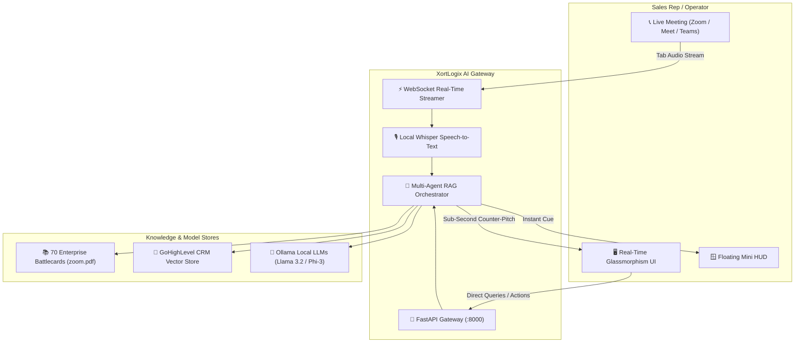

<div align="center">

# ⚡ XORTLOGIX
### Enterprise AI Solutions, Real-Time Voice RAG & Automation Ecosystem

[](https://python.org)
[](https://fastapi.tiangolo.com/)
[](https://www.trychroma.com/)
[](https://ollama.ai/)
[](https://websockets.spec.whatwg.org/)
[](LICENSE)

<p align="center">
  <b>A unified suite of local, private, and high-performance AI tools engineered for enterprise sales intelligence, automated CRM pipelines, and intelligent knowledge retrieval.</b>
</p>

[Ecosystem Projects](#-ecosystem-projects) • [Key Capabilities](#-key-capabilities) • [Architecture](#-architecture) • [Quickstart](#-quickstart) • [Security & Privacy](#-security--privacy)

---

</div>

## 🌌 Ecosystem Projects

```
XORTLOGIX/
├── 🎙️ rag_sales_assistant_local_ui/    # Real-Time AI Sales Voice Co-Pilot & Intent Decider
└── ⚡ GHL_RAG_Project_Local/             # GoHighLevel (GHL) Intelligent RAG & CRM Assistant
```

### 1. 🎙️ [Sales Voice Co-Pilot (`rag_sales_assistant_local_ui`)](./rag_sales_assistant_local_ui)
A real-time AI sales co-pilot designed to listen to client objections during live calls (**Zoom / Google Meet / MS Teams**) and provide instant, high-converting battlecards and closing strategies.
- **⚡ Sub-Second Retrieval**: `<50ms` vector retrieval across 70 structured enterprise sales battlecards (`zoom.pdf`).
- **🎯 Psychology & Intent Decider**: Uncovers client hidden fears, cost concerns, and provides actionable Do's and Don'ts.
- **🛰️ Live Tab Audio Streaming**: WebRTC-based meeting audio capture with local OpenAI Whisper transcription.
- **🪟 Floating Zoom HUD**: Screen-share safe, draggable, transparent overlay.
- **🌓 Dual Theme Cockpit**: Cyber-Dark Glassmorphism and Crisp Light Mode with zero layout shift.

### 2. ⚡ [GoHighLevel RAG Engine (`GHL_RAG_Project_Local`)](./GHL_RAG_Project_Local)
Enterprise RAG pipeline and automation microservice integrated with GoHighLevel CRM workflows.
- **🧠 ChromaDB Vector Store**: Semantic indexing of customer interactions, workflows, and domain knowledge.
- **🔌 Microservice Architecture**: FastAPI endpoints for seamless webhook integration and automated response generation.
- **📊 SQLite Database Management**: Scalable local tracking of conversations, lead history, and vector embeddings.

---

## 🏗️ Architecture Overview



---

## 🚀 Quickstart

### Prerequisites
- **Python 3.10+**
- **Git**
- *(Optional)* **Ollama** installed locally (`ollama serve`)

### Installation & Execution

#### Option A: Run the Sales Voice Co-Pilot
```bash
# Navigate to the sales assistant directory
cd rag_sales_assistant_local_ui

# Install dependencies
pip install -r requirements.txt

# Launch with One-Click launcher
python run_assistant.py
```
> Server will boot at `http://127.0.0.1:8000` and automatically open your browser cockpit.

#### Option B: Run the GHL RAG Microservice
```bash
# Navigate to the GHL project directory
cd GHL_RAG_Project_Local

# Install dependencies
pip install -r requirements.txt

# Start the application
python app.py
```

---

## 🔒 Security & Privacy

- 🛡️ **100% Local Execution**: All transcription (Whisper), retrieval (ChromaDB), and synthesis (Ollama) can run entirely offline on the local workstation.
- 🚫 **Zero Third-Party Data Leakage**: Client audio and proprietary battlecards never leave your local infrastructure.
- 🤝 **Safe Meeting Integration**: Uses standard client-side browser WebRTC permissions without requiring invasive meeting bot accounts.

---

## 🛠️ Technology Stack

| Layer | Technologies |
| :--- | :--- |
| **Backend & APIs** | FastAPI, Uvicorn, Python 3.10+, WebSockets |
| **Vector DB & RAG** | ChromaDB, LangChain, PyPDF, Hybrid Lexical-Semantic Matcher |
| **Speech & Audio** | OpenAI Whisper, Web Speech API, WebRTC `getDisplayMedia` |
| **Local LLM Engine** | Ollama (Llama 3.2 3B/1B, Phi-3, Nomic Embeddings) |
| **Frontend Cockpit** | HTML5, Modern Vanilla CSS3 (Cyber-Glassmorphism), JavaScript (ES6+) |

---

<div align="center">
  <sub>Developed & Maintained with pride by <b>XortLogix Engineering</b></sub><br>
  <sub>© 2026 XortLogix. All rights reserved.</sub>
</div>
