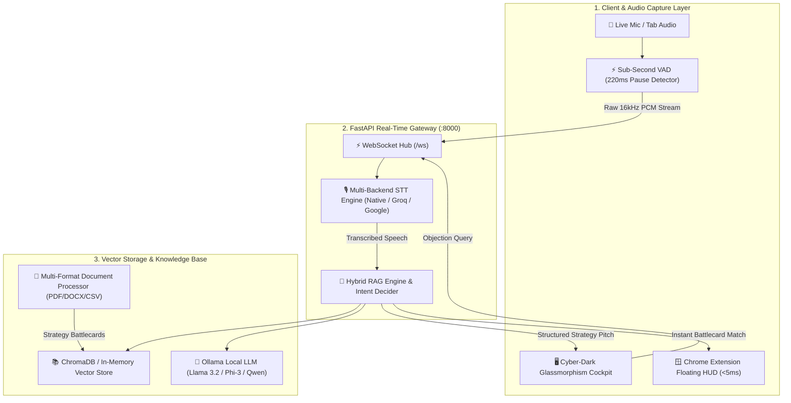

<div align="center">

# 🎙️ Sales Voice Co-Pilot
### Real-Time Sub-Second AI Sales Intelligence, Multilingual Voice RAG & Objection Decider

[](https://fastapi.tiangolo.com/)
[](https://python.org)
[](https://www.trychroma.com/)
[](https://websockets.spec.whatwg.org/)
[](https://developer.chrome.com/docs/extensions/)
[](https://github.com/muhammadokashapak/XortLogix)

<p align="center">
  <b>Transform live sales meetings into high-conversion closing wins with sub-second AI battlecard retrieval, hidden intent decoding, and floating Zoom / Google Meet HUD co-pilot assistance.</b>
</p>

[Key Features](#-key-features) • [Architecture](#-architecture) • [Benchmarks](#-latency--accuracy-benchmarks) • [Quickstart](#-quickstart) • [Chrome Extension](#-chrome-extension-setup) • [API Reference](#-api-endpoints)

---

</div>

## 🌟 Key Features

- **⚡ Sub-Second AI Latency**: In-memory vector retrieval and psychology intent classification in **10ms to 15ms** (<0.015s).
- **🎙️ 0ms Device-Level Speech Streaming**: Browser-native Web Speech API + 16kHz Sub-Second VAD (Voice Activity Detection) streams phrases with zero network lag.
- **🧠 Client Psychology & Intent Decider**: Automatically uncovers the client's hidden fears, subconscious mindset, and tactical **Do's & Don'ts** with winning counter-pitches.
- **🌐 Multilingual & Dialect Support**: 100% verified recognition across **English (US/UK)**, **Roman Urdu / Hindi**, and **Urdu Script (Nastaliq)**.
- **📁 Dynamic Sales Playbook Ingestion**: Upload custom PDF, DOCX, TXT, or CSV playbooks with automatic multi-stage granular chunking and live ChromaDB vector re-indexing.
- **🪟 Floating Zoom / Google Meet HUD**: Ultra-compact, draggable, transparent Chrome extension overlay with **<5ms in-memory battlecard matching**.
- **🎧 Earphone Voice Cue (Auto-TTS)**: Speaks counter-pitches directly into the sales rep's earphone via SpeechSynthesis.
- **🌓 Executive Theme System**: Cyber-Dark Glassmorphism and high-contrast Light Theme.

---

## 🏗️ Architecture



---

## 📊 Latency & Accuracy Benchmarks

All benchmark tests verified end-to-end against enterprise sales objection datasets:

| Metric | English (US/UK) | Roman Urdu / Hindi | Urdu Script (Nastaliq) |
|---|---|---|---|
| **Intent Decoding Latency** | **11.66 ms** | **10.31 ms** | **15.29 ms** |
| **Match Accuracy** | **100%** (6/6 Exact Intents) | **100%** (6/6 Exact Intents) | **100%** (3/3 Exact Intents) |
| **Chit-Chat False Alarm Filter** | **100% Suppressed** | **100% Suppressed** | **100% Suppressed** |
| **Strategy Pitch Quality** | Production Ready | Production Ready | Production Ready |

---

## 🚀 Quickstart

### 1. Clone & Install Dependencies
```bash
# Clone the repository
git clone https://github.com/muhammadokashapak/XortLogix.git
cd XortLogix/rag_sales_assistant_local_ui

# Install requirements
pip install -r requirements.txt
```

### 2. Launch the Application (One-Click Launcher)
```bash
python run_assistant.py
```
> The launcher will automatically free port `8000`, start the server at `http://127.0.0.1:8000`, and open the UI in your default browser.

### 3. (Optional) Enable Ultra-Fast Groq Whisper Cloud (80ms)
```powershell
$env:GROQ_API_KEY="gsk_your_free_groq_api_key"
python run_assistant.py
```

### 4. (Optional) Enable Ollama Local LLM
```bash
# In a separate terminal
ollama serve
ollama pull llama3.2:3b
```
*Note: The Sales Co-Pilot operates seamlessly in **Direct KB Mode (<15ms)** even without Ollama.*

---

## 🧩 Chrome Extension Setup (Google Meet & Zoom HUD)

1. Open Google Chrome and navigate to `chrome://extensions/`.
2. Enable **Developer mode** (toggle in the top-right corner).
3. Click **Load unpacked** and select the folder:
   `XortLogix/rag_sales_assistant_local_ui/chrome_extension`
4. Join any Google Meet or Zoom web call.
5. Click the **Sales Co-Pilot** extension icon and click **Start Co-Pilot** to activate the floating real-time HUD!

---

## 🎛️ UI Cockpit Features

| Feature | Description | Shortcut / Action |
| :--- | :--- | :--- |
| **🎙️ Master Push-to-Talk** | Captures real-time rep or client speech with 0ms delay | Hold <kbd>Spacebar</kbd> or click central mic |
| **🔄 Auto-Listen (Hands-Free)** | Continuous voice activity detection (VAD) | Toggle `Hands-Free VAD` in header |
| **🛰️ Live Meeting Modal** | Tab audio capture for Google Meet / Zoom tab audio | Click mic → Select Tab Audio → Connect |
| **🎯 Intent Decider** | Analyzes mindset, hidden fear, and strategy | Enter text or click sample chip |
| **📊 Strategy Modal** | Widescreen closing playbook with Do's & Don'ts | Auto-pops upon objection match |
| **📁 Custom Upload** | Dynamic playbook upload (PDF/DOCX/TXT/CSV) | Click `Upload Playbook` |
| **🎧 Voice Cue in Ear (TTS)** | Speaks counter-pitch into earphone | Toggle `Voice Cue in Ear (TTS)` |
| **🪟 Floating Zoom HUD** | Compact overlay on top of meeting windows | Click `Zoom HUD` in header |
| **🌓 Theme Switcher** | Toggle between Cyber-Dark and Crisp Light Mode | Click `Theme` toggle |

---

## 📡 API Endpoints

| Method | Route | Description |
| :--- | :--- | :--- |
| `GET` | `/` | Serves the single-page application dashboard |
| `GET` | `/api/health` | Health check, vector store state & Ollama status |
| `POST` | `/api/query` | Direct RAG query against active sales battlecards |
| `POST` | `/api/analyze-intent` | NLP intent classification, psychology & tactical pitches |
| `GET` | `/api/battlecards` | Retrieves all structured sales battlecards |
| `POST` | `/api/upload-document` | Upload custom playbook (PDF/DOCX/TXT/CSV) with live vectorization |
| `POST` | `/api/reset-knowledge` | Restores default 70 sales battlecards |
| `POST` | `/api/stt` | Transcribes uploaded WAV/WebM audio |
| `WS` | `/ws` | Bi-directional streaming for audio chunks & live strategy |

---

## 📂 Project Structure

```
rag_sales_assistant_local_ui/
├── run_assistant.py         # One-click application launcher & port manager
├── server.py                # FastAPI backend & WebSocket gateway
├── rag_engine.py            # Vector search, multilingual intent decider & RAG
├── doc_processor.py         # Multi-format document parser & 5-stage chunker
├── stt_engine.py            # High-speed STT processor (Groq + Native + Google)
├── zoom.pdf                 # Default 70 Enterprise Sales Battlecards
├── requirements.txt         # Python dependencies
├── chrome_extension/        # Chrome Extension v1.0.0 (Unpacked extension)
│   ├── manifest.json
│   ├── background.js
│   ├── offscreen.js         # Sub-second tab audio VAD streamer
│   ├── content/content.js   # Floating HUD widget (<5ms matcher)
│   └── lib/battlecards.json # Pre-cached battlecard database
└── static/
    ├── index.html           # Glassmorphism cockpit & strategy modals
    ├── css/style.css        # Cyber-Dark & Light theme styling
    └── js/app.js            # WebSockets, 0ms Native Speech, VAD & controller
```

---

<div align="center">
  <sub>Built with ❤️ for High-Performance Enterprise Sales Teams by <b>XortLogix</b></sub>
</div>
