# Architecture Documentation (Offline Video Translator)

## 1. Architectural Philosophy

The application is structured according to **Clean Architecture** principles and **Android Jetpack Guidelines (MVVM with Unidirectional Data Flow)**.

```text
┌─────────────────────────────────────────────────────────────┐
│                    UI Layer (Compose)                       │
│   HomeScreen  •  MediaPlayerScreen  •  ProcessingScreen    │
│   HistoryScreen  •  SettingsScreen  •  Custom Controls      │
└──────────────────────────────┬──────────────────────────────┘
                               │ StateFlow / Events
┌──────────────────────────────▼──────────────────────────────┐
│                      ViewModel Layer                        │
│   HomeVM  •  MediaPlayerVM  •  ProcessingVM  •  SettingsVM   │
└──────────────────────────────┬──────────────────────────────┘
                               │ Coroutines Flow
┌──────────────────────────────▼──────────────────────────────┐
│                       Domain Layer                          │
│   ProcessMediaUseCase • GetSubtitlesUseCase • ManageModels  │
└──────┬───────────────────────┼───────────────────────┬──────┘
       │                       │                       │
┌──────▼─────────────┐ ┌───────▼──────────────┐ ┌──────▼─────────────┐
│  AI Subsystem      │ │  Audio Engine        │ │  Data / Local DB   │
│  - WhisperOnnx     │ │  - MediaExtractor    │ │  - AppDatabase     │
│  - MarianOnnx      │ │  - MediaCodec (16k)  │ │  - MediaDao        │
│  - VadDetector     │ │  - Resampler         │ │  - SubtitleDao     │
│  - AudioPreprocess │ │  - WavUtils          │ │  - Preferences     │
└────────────────────┘ └──────────────────────┘ └────────────────────┘
```

---

## 2. End-to-End Offline AI Pipeline

```mermaid
sequenceDiagram
    autonumber
    actor User
    participant SAF as Media Picker (SAF)
    participant UI as ProcessingScreen
    participant UC as ProcessMediaUseCase
    participant Decoder as AudioExtractor (MediaCodec)
    participant VAD as VadDetector
    participant STT as WhisperOnnxSpeechRecognizer
    participant NMT as MarianOnnxTranslationEngine
    participant DB as Room Database (AppDatabase)
    participant Player as ExoPlayer / SubtitleSynchronizer

    User->>SAF: Pick Video / Audio
    SAF-->>UI: Content URI
    User->>UI: Press "Start Translation"
    UI->>UC: execute(uri, srcLang, tgtLang)
    
    rect rgb(30, 41, 59)
        note over UC,Decoder: Stage 1: Audio Extraction
        UC->>Decoder: extract16kHzMonoSamples(uri)
        Decoder-->>UC: FloatArray (16kHz PCM mono)
    end

    rect rgb(30, 41, 59)
        note over UC,VAD: Stage 2: Voice Activity Detection
        UC->>VAD: detectSpeechChunks(FloatArray)
        VAD-->>UC: List<SpeechChunk> (Timestamps + Samples)
    end

    rect rgb(30, 41, 59)
        note over UC,STT: Stage 3: Offline Transcription
        UC->>STT: transcribe(SpeechChunks)
        STT-->>UC: List<TranscriptSegment> (Original text)
    end

    rect rgb(30, 41, 59)
        note over UC,NMT: Stage 4: Offline Translation
        UC->>NMT: translateBatch(Segments, src, tgt)
        NMT-->>UC: List<String> (Translated text)
    end

    rect rgb(30, 41, 59)
        note over UC,DB: Stage 5: Persistence
        UC->>DB: saveSubtitles(mediaHash, Segments)
        UC->>DB: saveOrUpdateMedia(hasTranslation = true)
    end

    UC-->>UI: ProcessingState.Completed
    UI->>Player: Play media + stream active subtitles
```



---

## 3. Key Subsystems & Design Choices

### 3.1 Audio Decoding (`AudioExtractor`)
* Uses Android's low-level `MediaExtractor` and `MediaCodec` to decode compressed audio streams (AAC, Opus, MP3, Vorbis, FLAC) directly into raw PCM buffers.
* Downmixes multi-channel audio (stereo/5.1) to mono by averaging channels.
* Employs linear interpolation resampling to guarantee exact 16,000 Hz sample rate required by speech recognition models.
* Avoids creating multi-gigabyte temporary files by streaming audio chunks directly.

### 3.2 Voice Activity Detection (`VadDetector`)
* Computes Root Mean Square (RMS) energy in 30ms sliding windows.
* Detects voice boundaries and groups continuous speech into natural 1 to 25-second utterances.
* Prevents spending model compute time on silent audio gaps.

### 3.3 Speech-to-Text (`WhisperOnnxSpeechRecognizer`)
* Preprocesses chunk audio into 80-bin Log Mel-Spectrogram (using 400 FFT, 160 hop length, Hanning window, and Mel filterbank).
* Executes quantized Whisper ONNX models via `OrtSession`.
* Automatically releases native ONNX memory when processing is finished.

### 3.4 Neural Machine Translation (`MarianOnnxTranslationEngine`)
* Tokenizes original sentences into subword tokens using BPE/SentencePiece dictionaries.
* Executes Seq2Seq ONNX sessions in autoregressive decoding steps.
* Gracefully passes through text if source and target languages are identical.

### 3.5 Real-Time Subtitle Synchronization (`SubtitleSynchronizer`)
* Operates on a 100ms ticker attached to `ExoPlayer.currentPosition`.
* Executes binary search over pre-sorted subtitle intervals `[startTimeMs, endTimeMs]`.
* Supports positive and negative user delay offsets (`delayOffsetMs`).
* Renders dynamically within Compose `SubtitleOverlay` with high-contrast text backing.

---

## 4. Memory & Performance Strategy for Low-End Devices

1. **Lazy Model Session Loading**: ONNX model files are only loaded into RAM when transcription or translation is actively running.
2. **Explicit Session Release**: `OrtSession` and `OrtEnvironment` are explicitly closed immediately upon job completion or cancellation.
3. **No Redundant Reprocessing**: Media files are hashed by URI, name, and size. Reopening a previously processed video immediately loads cached subtitles from SQLite/Room.
4. **Coroutine Thread Isolation**: Heavy DSP and ONNX inferences run on `Dispatchers.Default`, file I/O runs on `Dispatchers.IO`, while UI remains smooth and responsive on `Dispatchers.Main`.
