<div align="center">

# 🎬 Offline AI Video & Audio Translator
### ⚡ 100% On-Device • Zero Cloud • Real-Time AI Subtitles • Android App

<p align="center">
  
  
  
  
  
  
</p>

<p align="center">
  <b>Play any video or audio file on your Android device and get real-time, synchronized, translated subtitles completely offline — zero internet, zero cloud APIs, and zero subscription costs.</b>
</p>

---

[✨ Key Features](#-key-features) • [🧠 AI Pipeline](#-ai-pipeline-architecture) • [🌍 Supported Languages](#-supported-languages) • [📲 Installation & Quickstart](#-installation--quickstart) • [⚡ Performance](#-performance-benchmarks) • [🛠️ Troubleshooting](#️-troubleshooting)

---

</div>

## ✨ Key Features

<div align="center">

| 🎙️ Offline Speech-to-Text | 🌍 Neural Machine Translation | 💬 Synchronized Subtitles |
| :---: | :---: | :---: |
| On-device **OpenAI Whisper (INT8)** transcribes speech accurately with Voice Activity Detection (VAD). | Autoregressive **MarianMT / OPUS-MT** seq2seq models translate English to Urdu, Spanish, and more. | Binary search synchronizer ensures precise subtitle alignment with adjustable timing offsets. |

| 🎬 Modern Media Player | 💾 Smart Caching & History | 📦 Out-of-the-Box Setup |
| :---: | :---: | :---: |
| Built on **Media3 / ExoPlayer** with gesture controls, aspect ratio toggles, and playback speeds. | **Room SQLite** caches processed transcripts so videos never need to be re-translated twice. | **All AI models are pre-bundled** inside the APK; installs and works with zero downloads. |

</div>

---

## 🧠 AI Pipeline Architecture

```mermaid
flowchart LR
    subgraph Input ["1. Media Input"]
        V["🎬 Video / Audio File\n(MP4, MKV, MP3, WAV)"]
    end

    subgraph AudioEngine ["2. Audio Pipeline"]
        E["🎧 MediaExtractor + Codec\n(16kHz Mono Float PCM)"]
        VAD["⚡ Energy VAD Filter\n(Silence Stripping)"]
        Mel["📊 80-bin Log-Mel\nSpectrogram"]
    end

    subgraph AIInference ["3. On-Device AI Engine (ONNX Mobile)"]
        WEnc["🎙️ Whisper Encoder\n(Quantized INT8)"]
        WDec["🔄 Autoregressive Decoder\n(Token Generation)"]
        NMT["🌍 MarianMT Seq2Seq\n(English → Urdu / Spanish)"]
    end

    subgraph Output ["4. Synchronized Playback"]
        SubSync["⚡ Binary Search Matcher"]
        ExoView["▶️ ExoPlayer + Jetpack Compose\nDual Subtitle HUD"]
    end

    V --> E --> VAD --> Mel --> WEnc --> WDec --> NMT --> SubSync --> ExoView
```



---

## 🌍 Supported Languages

### 🎙️ Speech Recognition (Whisper Auto-Detection)
Detects and transcribes **99+ languages offline**, including:
* **English (`en`)**, **Urdu (`ur`)**, **Hindi (`hi`)**, **Arabic (`ar`)**, **Spanish (`es`)**, **French (`fr`)**, **German (`de`)**, **Chinese (`zh`)**, **Japanese (`ja`)**, **Russian (`ru`)**, **Turkish (`tr`)**, **Punjabi (`pa`)**, and more.

### 🌐 Neural Translation (MarianMT Language Packs)

| Source Language | Target Language | Model Status |
| :--- | :--- | :--- |
| **English** | **اردو (Urdu)** | 🟢 **Pre-Installed & Ready** |
| **English** | **Spanish (Español)** | 🟢 **Pre-Installed & Ready** |
| **English** | **Arabic (العربية)** | 🟡 Supported (Import via Settings) |
| **English** | **French (Français)** | 🟡 Supported (Import via Settings) |
| **English** | **German (Deutsch)** | 🟡 Supported (Import via Settings) |
| **English** | **Hindi (हिन्दी)** | 🟡 Supported (Import via Settings) |
| **English** | **Chinese / Japanese** | 🟡 Supported (Import via Settings) |

---

## 📲 Installation & Quickstart

### 🚀 Option 1: Direct APK Install (Recommended)

1. Locate the compiled standalone APK on your computer:
   ```text
   E:\Okashaaaaa\Projects\Video Player\app\build\outputs\apk\debug\app-debug.apk
   ```
2. Send `app-debug.apk` to your phone (via **WhatsApp**, **USB**, or **Bluetooth**).
3. Tap **Install** on your phone.
4. Launch the app, pick any video, and tap **"Start Translation"**!

### 💻 Option 2: Build From Source via Android Studio / Gradle

```bash
# Clone the repository
git clone https://github.com/muhammadokashapak/XortLogix.git
cd XortLogix/offline_ai_video_translator

# Build debug APK
./gradlew assembleDebug

# Run unit tests
./gradlew testDebugUnitTest
```

---

## ⚡ Performance Benchmarks

*Tested on mid-range Android ARM64 hardware:*

| Benchmark Stage | Metrics |
| :--- | :--- |
| **APK Footprint** | **~188 MB** *(Includes all quantized AI weights and native runtime)* |
| **Audio Extraction Speed** | **10x real-time** *(MediaExtractor + MediaCodec)* |
| **Whisper STT Latency** | **~1.2s – 1.6s** per 30s chunk |
| **MarianMT Translation Latency** | **~250ms – 400ms** per sentence |
| **Memory Footprint (RAM)** | **~280 MB – 380 MB** during active inference |
| **Offline Privacy** | **100% Air-Gapped** *(Zero network permissions required)* |

---

## 🛠️ Troubleshooting

<details>
<summary><b>❓ Q: Does the app require an internet connection on first run?</b></summary>
<b>No!</b> All Whisper STT and MarianMT translation weights are bundled directly inside the APK. The app will self-extract the models on first startup in airplane mode.
</details>

<details>
<summary><b>❓ Q: How do I export subtitles as .SRT or .VTT files?</b></summary>
Once a video has finished processing, open the <b>History</b> tab or tap the <b>Share / Export</b> button on the player controls to save standard <code>.srt</code> or <code>.vtt</code> files to your device storage.
</details>

<details>
<summary><b>❓ Q: What video and audio formats are supported?</b></summary>
All standard Android Media3 / ExoPlayer codecs including <b>MP4, MKV, WebM, AVI, MOV, 3GP, MP3, AAC, WAV, FLAC, and OGG</b>.
</details>

---

<div align="center">

### 🌟 Powered by **XORTLOGIX Mobile AI**
<sub>Crafted with Kotlin, Jetpack Compose, and ONNX Runtime Mobile.</sub><br>
<sub>© 2026 XortLogix. All rights reserved.</sub>

</div>
