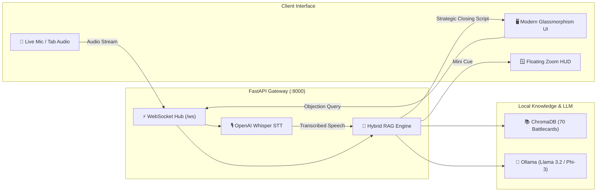

<div align="center">

# 🎙️ Sales Voice Co-Pilot
### Real-Time Local AI Sales Intelligence, Voice RAG & Intent Decider

[](https://fastapi.tiangolo.com/)
[](https://python.org)
[](https://www.trychroma.com/)
[](https://github.com/openai/whisper)
[](https://ollama.ai/)
[](https://websockets.spec.whatwg.org/)

<p align="center">
  <b>Transform live sales calls into high-conversion closing opportunities with sub-second AI battlecard retrieval, hidden intent decoding, and voice assistance.</b>
</p>

[Key Features](#-key-features) • [Architecture](#-architecture) • [Quickstart](#-quickstart) • [UI Overview](#-ui-cockpit-features) • [API Reference](#-api-endpoints)

---

</div>

## 🌟 Highlights

- **⚡ Sub-Second AI Latency**: Retrieves enterprise sales battlecards in `<50ms` locally with zero external cloud dependencies.
- **🛰️ Live Meeting Co-Pilot**: Directly captures live client audio from **Google Meet**, **Zoom**, or **MS Teams** browser tabs via WebRTC.
- **🎯 Client Intent & Psychology Decider**: Classifies client objections, uncovers subconscious fears, and generates tactical Do's & Don'ts with ready-to-speak pitches.
- **🎧 Voice Cue in Ear (TTS)**: Whisper-guided natural English text-to-speech cue directly into the rep's earphones.
- **🪟 Floating Zoom HUD**: Ultra-compact, draggable, transparent overlay for seamless reference during screen shares.
- **🌓 Dual Executive Themes**: Cyber-Dark Glassmorphism and high-contrast Light Theme with zero layout shifts.

---

## 🏗️ Architecture



---

## 🚀 Quickstart

### 1. Clone & Install Dependencies
```bash
# Clone the repository
git clone https://github.com/muhammadokashapak/XortLogix.git
cd XortLogix/rag_sales_assistant_local_ui

# Install requirements
pip install -r requirements.txt
```

### 2. Launch the Application (One-Click Launch)
```bash
python run_assistant.py
```
> The launcher will automatically start the server at `http://127.0.0.1:8000` and open your default browser.

### 3. (Optional) Enable Ollama Local LLM
```bash
# In a separate terminal
ollama serve
ollama pull llama3.2:3b
```
*Note: The assistant operates seamlessly in **Direct KB Mode** even without Ollama running.*

---

## 🎛️ UI Cockpit Features

| Feature | Description | Shortcut / Action |
| :--- | :--- | :--- |
| **🎙️ Master Push-to-Talk** | Captures real-time rep or client speech | Hold <kbd>Spacebar</kbd> or click central mic |
| **🔄 Auto-Listen (Hands-Free)** | Continuous voice activity detection (VAD) | Toggle switch in header |
| **🛰️ Live Meeting Modal** | Tab audio capture for Zoom/Meet/Teams | Click mic icon → Start Stream |
| **🎯 Intent Decider** | Analyzes mindset, hidden fear, and strategy | Enter text or click sample chip |
| **📊 2-Column Strategy Modal** | Widescreen closing playbook & objection defense | Auto-pops upon objection match |
| **🎧 Voice Cue in Ear (TTS)** | Speaks counter-pitch into earphone | Toggle `Voice Cue in Ear` |
| **🪟 Floating Zoom HUD** | Compact overlay on top of meeting windows | Click `Zoom HUD` in top navigation |
| **🌓 Theme Switcher** | Toggle between Cyber-Dark and Crisp Light Mode | Click `Moon / Sun` button |

---

## 📡 API Endpoints

| Method | Route | Description |
| :--- | :--- | :--- |
| `GET` | `/` | Serves the single-page application dashboard |
| `GET` | `/api/health` | Health check, vector store state & Ollama status |
| `POST` | `/api/query` | Direct RAG query against the 70 battlecard database |
| `POST` | `/api/analyze-intent` | NLP intent classification, psychology & tactical tips |
| `GET` | `/api/battlecards` | Retrieves all 70 structured sales battlecards |
| `POST` | `/api/stt` | Transcribes uploaded WAV/WebM audio using Whisper |
| `WS` | `/ws` | Real-time bi-directional streaming for audio & strategy |

---

## 📂 Project Structure

```
rag_sales_assistant_local_ui/
├── run_assistant.py      # One-click application launcher
├── server.py             # FastAPI backend & WebSocket server
├── rag_engine.py         # Vector search, intent decider & Ollama synthesis
├── stt_engine.py         # Local Whisper Speech-to-Text processor
├── zoom.pdf              # 70 Enterprise Q&A Sales Battlecards Knowledge Base
├── requirements.txt      # Python dependencies
└── static/
    ├── index.html        # Glassmorphism cockpit & strategy modals
    ├── css/
    │   └── style.css     # Cyber-Dark & Light theme styling system
    └── js/
        └── app.js        # WebSockets, audio streaming, VAD & UI controller
```

---

<div align="center">
  <sub>Built with ❤️ for High-Performance Enterprise Sales Teams by <b>XortLogix</b></sub>
</div>
